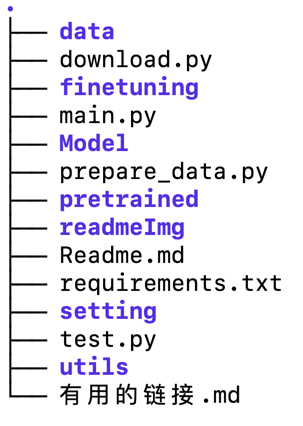
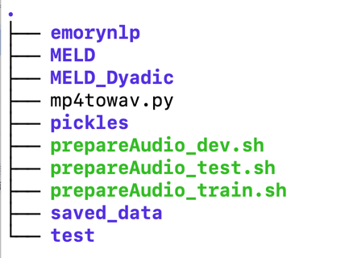
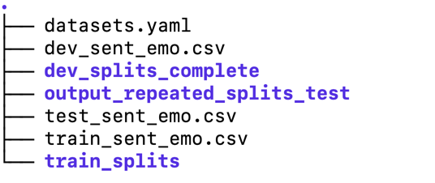

# MultiModal Sentiment Analysis Pytorch（多模态情绪识别探索）
未完待续......

## Introduction 

Sentiment-Analysis是NLP方向的一个经典分类问题，而使用单一的文本信息去判断情感效果往往不会太好，
而在多模态学习的火热的当前背景下，结合多种模态信息来综合考虑情感的分类成为可能。目前本项目先考虑文本和语音两种模态信息。

## Dataset 

本项目使用MELD数据集，MELD数据选自《老友记》的对话，是一个多模态数据集。
包含了文本和其对应的语音和视频。

MELD论文来源：MELD: A Multimodal Multi-Party Dataset for Emotion Recognition in Conversation

数据集获取方式：网上很多

## 模型选择和特征抽取
 
本项目使用pytorch框架，重点使用huggingface里的transformers库
huggingface社区中模型选择丰富，无论是NLP模型还是语音模型。

### 文本特征的抽取

文本特征选择BERT模型，具体使用huggingface中的bert-base-uncased

### 语音特征的抽取

语音领域对应NLP中BERT模型的是 HuBERT。
关于HuBERT，一种在语音方向的基于BERT的self-supervised预训练模型，思想很妙，
具体读者可查阅HuBERT论文。

## 多模态的特征融合

当文本和语音的关于情绪的特征被抽取出来之后，我们有很多方法来做特征融合

我个人使用了如下的特征融合方式
1. 在multimodal1和multimodal2 中，我们将bert和hubert提取的模态特征进行concat之后送入分类网络
2. 在multimodal3中，我们使用cross modal attention，将文本模态和语音模态的特征提取出来之后互相进行attention，然后再self attention 然后再 concat。 或者进行一些其他的模型拼补。

## 环境配置以及运行

先运行download文件，将预训练模型和相关的配置 下载下来
然后运行main文件即可

## 关于运行时候的目录问题
   
这个为项目的一级目录结构,然后我们进入data里面看一下data的目录结构  
  
这个是我服务器上最后的data目录，下面我来讲讲这里面文件夹都是干啥的。

1. emorynlp 这个是里面有三个csv文件存的文本信息，用于文本模态的数据
2. MELD 存放音视频模态的数据，等会再讲
3. MELD_Dyadic 我这个项目里没用
4. mp4towav.py  因为MELD数据集只有视频，我写的这个文件产生下面的三个prepareAudio.sh 然后运行.sh ，把视频中音频提取出来保存成mp3
，读者也可尝试更改此文件 使其能省略生成.sh这一中间步骤直接生成音频，我自己尝试一直有bug，好奇怪，只能出此下策。
5. pickles 没啥用
6. saved_data 这个是我在utils文件夹底下data里面的一个函数，把pytorch里面的Dataset直接存下来（把音频构建成dataset的格式有很多的预处理，相当于直接保存的预处理结果），这样以后重复运行的时候就可以省很多时间了。
 

然后我们进入MELD文件夹  
  
其他都没啥用，就看三个蓝色文件夹，文件夹下面是存的视频，
比如train_splits，里面有几十个视频，和一个wav文件夹，wav文件夹里面是这几十个视频对应的音频。
读者可以自己调整文件的存储路径，只要把代码里的路径给对应上即可。

